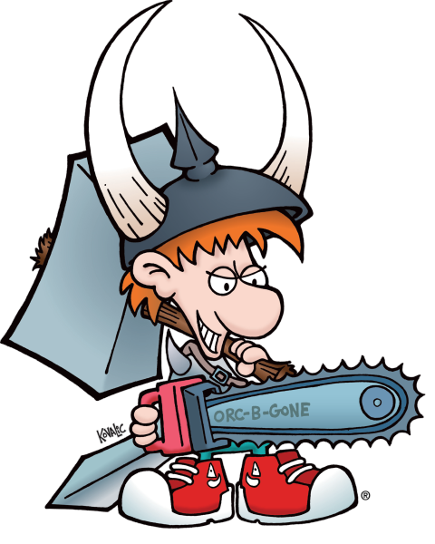

# ChainSaw

Situational Awareness (**Saw**) is a critical success factor.  
In order to succeed, individuals must collaborate and share their perspectives, creating a value **Chain**.  
Hence the project name.
Thanks to Munchkin for the inspiration, the irony and the spirit of adventure.  
Now go and break doors!

## Tutorials
1) <a href="https://www.youtube.com/watch?v=i38mPzcNWsQ" target="_blank">PO's Dashboard</a>
2) <a href="https://www.youtube.com/watch?v=7JP7ni4JgHQ" target="_blank">Component Diagram</a>

## Contents
### Product Owner
The dashboard (v.0.91)
